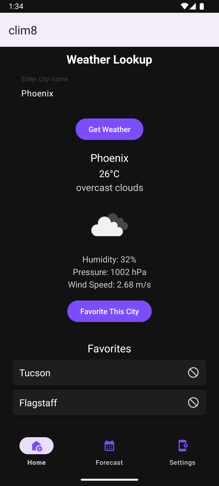
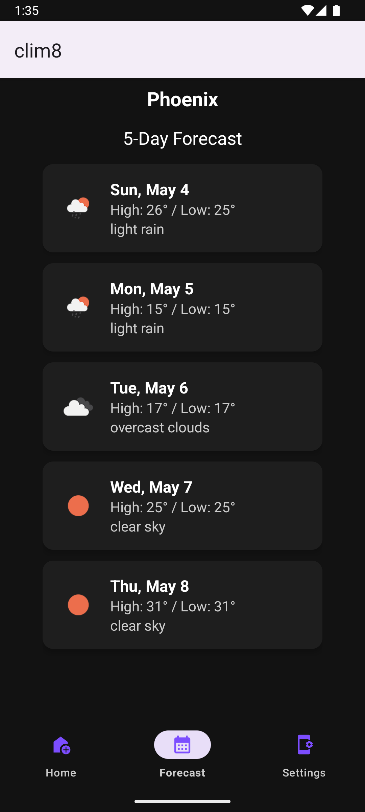
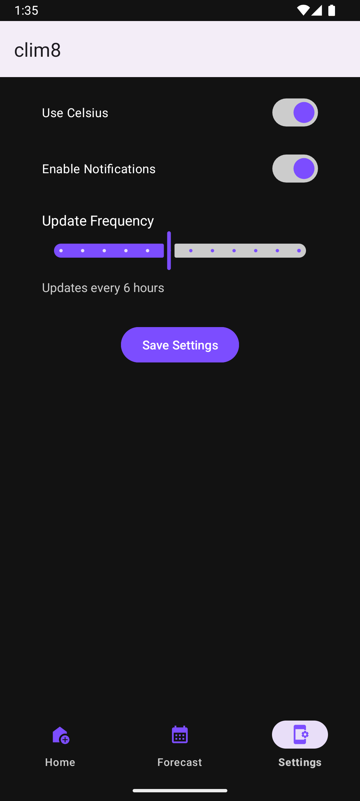

# 🌤️ Clim8

Clim8 is a modern, lightweight Android weather app built using Kotlin. It gives users accurate, real-time weather information through a clean, responsive UI. Designed with Jetpack libraries and a robust MVVM architecture, Clim8 is ideal for anyone wanting a simple yet powerful weather experience.

---

## 🚀 Features

- 🔍 Search weather by city name
- 📍 GPS-based current location weather
- 🌡️ Displays temperature, humidity, wind speed, pressure, and conditions
- 🌇 Shows sunrise and sunset times
- 🎨 Modern, XML-based UI design with dark mode support
- 🔄 Real-time 5-day forecast (3-hour intervals)
- ❤️ Save favorite cities and quickly access them
- ⚙️ Settings panel with update frequency, unit preference, and notifications toggle

---

## 🧱 Architecture

Clim8 uses the **MVVM (Model-View-ViewModel)** pattern to ensure separation of concerns and scalability:

- **View (Fragments):** `HomeFragment`, `ForecastFragment`, `SettingsFragment`
- **ViewModel:** `WeatherViewModel`
- **Model/Repository Layer:** `WeatherRepository`, `FavoriteCityDatabase`
- **Remote API:** `WeatherApiService` via Retrofit
- **Persistence:** Room database for favorite cities
- **Utilities:** `SettingsManager`, `TemperatureConverter`

---

## 🛠️ Built With

- **Kotlin** – Main programming language
- **Groovy DSL** – For Gradle configuration
- **Jetpack Components** – ViewModel, LiveData, Room, Navigation
- **Retrofit2** – For API calls
- **Coil** – Image loading for weather icons
- **OpenWeatherMap API** – Real-time weather data
- **Room** – Local storage for favorite cities

---

## 📱 Screenshots

### 🏠 Home Screen


### 📊 Forecast Screen


### ⚙️ Settings Screen



---

## 📦 Getting Started

### ✅ Prerequisites

- Android Studio Flamingo+ (or latest stable version)
- Android Emulator or physical device (API 26+)
- Free API key from [OpenWeatherMap](https://openweathermap.org/api)

### 📥 Installation Steps

1. **Clone the repository:**
   ```bash
   git clone https://github.com/ajs2583/clim8.git
   cd clim8
2. Open in Android Studio:
   - Open Android Studio → File > Open → Select the project folder
3. Insert your API key:
   - In your local.properties file, add:
        ```ini
        OPENWEATHER_API_KEY=your_api_key_here
        ```
4. Build and run the app:
   - Press the green Run ▶️ button or use Shift + F10

---

## 📫 Contact
Developed by Anthony Mastrangelo (@ajmastra) and Andrew Sliva (@ajs2583)

